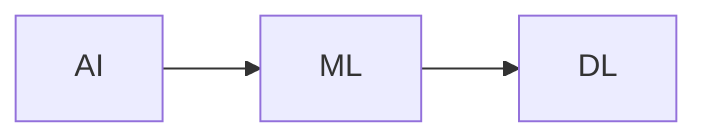

# Machine Learning (ML): Core Concepts and Business Relevance

## 🤖 What is Machine Learning?

Machine Learning (ML) is a subfield of Artificial Intelligence (AI) that enables computers to **learn from data and make predictions or decisions** without being explicitly programmed for every scenario.

> **ML = Learning + Prediction**

It is the foundational layer powering modern AI applications, including fraud detection, recommendation engines, spam filtering, and predictive analytics.

---

## 🧠 Relationship: AI vs ML vs DL

- **AI (Artificial Intelligence)** is the broad field of making machines intelligent.
- **ML (Machine Learning)** is a subset of AI focused on learning from data.
- **DL (Deep Learning)** is a further specialized subset of ML using neural networks for complex pattern recognition.

---

## 💼 Business Insight

> “A business enterprise has only two functions: **innovation and marketing** — the rest are costs.” – Peter Drucker

ML supports **innovation** by automating insights and **marketing** by personalizing outreach. Everything else gets streamlined or automated.

---

## 📬 Real-World ML Examples

- **Email**: Predicting and filtering spam messages
- **E-commerce (Amazon)**: Recommending products based on user behavior
- **Banking**: Predicting loan defaults
- **Healthcare**: Diagnosing diseases from lab results

---

## 🔍 Types of Machine Learning Algorithms

### 1. **Supervised Learning**

- Learns from labeled data (input → output)
- Common use: prediction, classification

#### 🔸 Regression

- Predicts continuous outcomes
- Example: Predicting revenue based on customer satisfaction

#### 🔸 Classification

- Assigns input into discrete categories
- Example: Is this email spam or not?
- Business Use Case: Age vs Time on Page to predict buying intent

### 2. **Unsupervised Learning**

- Learns from **unlabeled data**
- Common use: clustering, dimensionality reduction

#### 🔸 Clustering

- Groups data into natural clusters
- Example: Segmenting e-commerce users based on browsing behavior

#### 🔸 Association Rule Learning

- Discovers relationships between variables
- Example: Market basket analysis – “If customer buys X, they often buy Y”

---

## 🔁 ML Workflow

1. **Collect data**
2. **Prepare and clean data**
3. **Select algorithm**
4. **Train the model**
5. **Evaluate performance**
6. **Deploy and monitor**

---

## ✨ Summary

Machine Learning is at the heart of modern data-driven decision-making. It enables organizations to:

- Learn from historical data
- Predict future outcomes
- Automate repetitive tasks
- Deliver personalized user experiences

> ML is not magic — it's math, data, and iteration.
